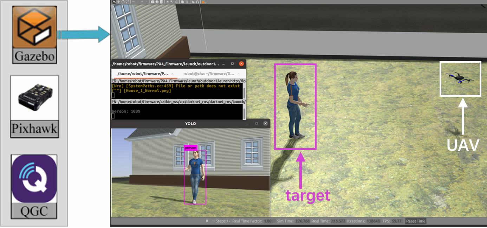

# Robust Image-Based Visual Servo Target Tracking of UAV with Depth Camera
### Huazhang Chen; Kewei Xia In ICIT, 2024
### [[paper:https://ieeexplore.ieee.org/abstract/document/10540793]](https://ieeexplore.ieee.org/abstract/document/10540793)

## Abstract
Tracking a target by using an unmanned aerial vehicle (UAV) without prior knowledge of the target's velocity and position is a critical and challenging task. This paper proposes a feasible approach that combines image-based visual servo (IBVS) with robust control. More specifically, a target detection algorithm is employed to acquire and calculate the pixel coordinates of the target's center. Simultaneously, the UAV utilizes a depth camera to measure the depth distance between the target and the UAV. Subsequently, the UAV directly computes flight control commands at the image pixel level through robust control, which comprises a force controller for position and a torque controller for attitude, separately. The UAV can continuously track the target through the aforementioned procedures. To validate the reliability of the proposed approach, a series of experiments and simulations are conducted.

## Workdflow of our tracker
<div style="display: flex; justify-content: center;">
  
</div>

## Simulation in Gazebo
<div style="display: flex; justify-content: center;">
  
</div>

## Actual experiment
<div style="display: flex; justify-content: center;">
  
  
</div>

## References 

```
@inproceedings{chen2024robust,
  title={Robust Image-Based Visual Servo Target Tracking of UAV with Depth Camera},
  author={Chen, Huazhang and Xia, Kewei},
  booktitle={2024 IEEE International Conference on Industrial Technology (ICIT)},
  pages={1--6},
  year={2024},
  organization={IEEE}
}
```
